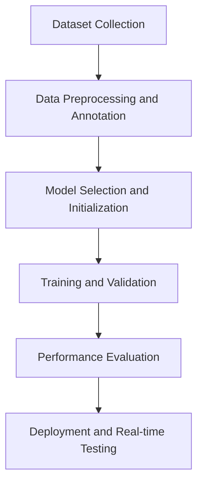

# Automated Mango Classification Using YOLOv11

## Project Description
This project implements an automated mango classification system using the YOLOv11 object detection framework. It aims to classify eight distinct mango varieties based on annotated images, offering a scalable solution for agricultural and commercial workflows.

## Features
- Real-time mango classification.
- Detection and labeling of eight mango varieties:
  - Anwar Ratool
  - Chaunsa (Black)
  - Chaunsa (Summer Bahisht)
  - Chaunsa (White)
  - Dosehri
  - Fajri
  - Langra
  - Sindhri
- High accuracy achieved through advanced YOLOv11 architecture and hyperparameter tuning.

## Dataset
- **Source**: Roboflow and Kaggle's "Mango Varieties Classification" dataset by Saurabh Shahane.
- **Size**: 1,600 annotated images (200 per mango variety).
- **Split**:
  - Training: 70%
  - Validation: 20%
  - Testing: 10%

- **Orignal Dataset**:
    ```
    https://www.kaggle.com/datasets/saurabhshahane/mango-varieties-classification
    ```
- **Annotated Dataset**:
    ```
    https://drive.google.com/drive/folders/1eWxJg2iAsf850mJlJXEJsPwCeR2WrXyb?usp=sharing
    ```
## Methodology
1. **Data Preprocessing**: Images were annotated and augmented to enhance diversity.
2. **Model Training**: YOLOv11 was trained for 100 epochs with optimized hyperparameters.
3. **Validation**: Performance metrics like precision, recall, and F1-score were calculated.
4. **Deployment**: Real-time testing was conducted to evaluate system efficiency.

### Flow Diagram


## Directory Structure
```
Mango-Classifier
├──mangoclassifyYOLO/
│   ├── weights/
│   |    ├── best.pt/
|   |    └── worst.pt/
│   └── all other are results
├── test/
│   ├── images/
│   └── labels/
├── train/
│   ├── images/
│   ├── labels/
│   └── labels.cache
├── valid/
│   ├── images/
│   ├── labels/
│   └── labels.cache
├── .gitignore
├── anwar_ratool.jpg
├── data.yaml
├── Fajri.jpeg
├── MangoClassifierYOLOv11.ipynb
├── README.dataset.txt
└── README.roboflow.txt
```

## Models and Tools Used
- **YOLOv11**: Efficient object detection framework.
- **Roboflow**: Dataset annotation and preprocessing.
- **Python with Ultralytics Framework**: Training and implementation.
- **Google Colab**: Training environment.

## Installation and Usage

### Prerequisites
- Python 3.8 or higher
- Required libraries: Ultralytics, OpenCV, Matplotlib

### Setup
1. Clone this repository:
   ```bash
   git clone https://github.com/tanmay-37/Mango-Classifier.git
   cd Mango-Classifier
   ```
2. Install dependencies:
   ```bash
   pip install i
   ```
3. Prepare the dataset:
   - Place annotated images in the `data` folder.
   - Update `data.yaml` with paths to train, validation, and test sets.


## Results
- Achieved high **precision** and **recall** during testing.
- High performance in real-time detection and classification.


- Results can be found :
  ```
  cd mangoclassifyYOLO/
  ```
- All the predicted results : 
  ```
  https://drive.google.com/drive/folders/10hAgppYbGMlWUs3-NLoOOgE7IkdaeOWQ?usp=sharing
  ```

## Contributors
- **Tanmay Talekar**
- **Sanchit Pahurkar**
- **Rohit Garg**

## License
This project is licensed under the MIT License.
